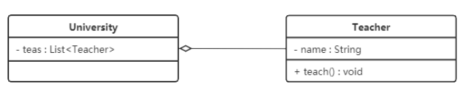

# Design Patterns

# 1. Overview of Design Patterns

## 1.1 The background of software design pattern

The concept of "design patterns" did not originally appear in software design, but was used in the design of architecture. In 1977, the renowned American architect and the director of the Center for Environmental Structure at the University of California, Berkeley, Christopher Alexander, described some common architectural design problems in his book "A Pattern Language: Towns, Buildings, Construction." He introduced 253 basic patterns for designing towns, neighborhoods, residences, gardens, and rooms.

By 1990, the software engineering community began discussing the topic of design patterns and subsequently held several conferences on the subject. It wasn't until 1995 that Erich Gamma, Richard Helm, Ralph Johnson, and John Vlissides co-authored the book "Design Patterns: Elements of Reusable Object-Oriented Software." This book included 23 design patterns, marking a milestone in the field and leading to a breakthrough in software design patterns. These four authors are also famously known in the software development domain as the "Gang of Four" or GoF.

## 1.2 The concept of software design patterns

A Software Design Pattern, also simply known as a Design Pattern, is a collection of code design experiences that are repeatedly used, widely known, categorized, and summarized. It outlines the recurring problems faced during the software design process and their respective solutions. That is to say, it embodies a series of approaches to address specific issues, capturing the accumulated design wisdom of past practitioners. These patterns hold general applicability and can be used over and over again.

## 1.3 The necessity of learning design patterns.

The essence of design patterns is the practical application of object-oriented design principles, reflecting a deep understanding of class encapsulation, inheritance, polymorphism, as well as the relationships and compositions among classes.

**Proper use of design patterns has the following advantages:**

1. It enhances the thinking, programming, and design capabilities of programmers.
2. It standardizes program design and makes code development more systematic, greatly improving software development efficiency and thereby shortening the software development cycle.
3. It ensures that the designed code has high reusability, readability, reliability, flexibility, and maintainability.

## 1.4 Classification of Design Patterns

* **Creational patterns**

  Used for delineating "how objects are created," the primary feature is "decoupling the process of object creation from its utilization." The GoF (Gang of Four) book presents five creational patterns: Singleton, Prototype, Factory Method, Abstract Factory, and Builder.

* **Structural patterns**

  Used to outline how to organize classes or objects into larger configurations following certain structures, the GoF (Gang of Four) book introduces seven structural patterns: Proxy, Adapter, Bridge, Decorator, Facade, Flyweight, and Composite.

* **Behavioral Patterns**

  These are concerned with how classes or objects interact and collaborate to achieve tasks that an individual object can't undertake by itself, as well as how roles and duties are allocated. In the GoF (Gang of Four) book, eleven behavioral patterns are presented: Template Method, Strategy, Command, Chain of Responsibility, State, Observer, Mediator, Iterator, Visitor, Memento, and Interpreter.

# 2. UML Diagram

The Unified Modeling Language (UML) is a visual modeling language employed for software design. Its hallmarks include being straightforward, unified, graphical, and capable of conveying both dynamic and static aspects of software design.

UML approaches the target system from different angles and stipulates nine diagram types: use case diagrams, class diagrams, object diagrams, state diagrams, activity diagrams, sequence diagrams, collaboration diagrams, component diagrams, and deployment diagrams.

## 2.1 Class Diagram Overview

The Class diagram illustrates the static structure of a model, particularly the classes within the model, their internal makeup, and their interrelationships with other classes. Temporary information is not shown in class diagrams. They are an essential aspect of object-oriented modeling.

## 2.2 The role of class diagrams

* In software engineering, a class diagram is a static structural diagram that depicts a collection of classes within a system, along with their attributes and relationships. It serves to simplify people's comprehension of the system.
* A class diagram is a vital artifact of the system analysis and design phases, serving as a crucial model for system coding and testing.

## 2.3 Representation of a class diagram

### 2.3.1 Representation of a class diagram

In UML class diagrams, classes are represented by rectangles containing class names, attributes (fields) and methods (methods) with dividing lines, such as
The figure below shows an Employee class, which contains three attributes of name, age and address, and the work() method.

The plus and minus signs added before attribute/method names indicate the visibility of these attributes/methods. In UML class diagrams, there are three symbols used to represent visibility:

1. **Public (+):** Attributes or methods marked with a plus sign (+) are indicative of public visibility. They are accessible from any part of the system, including external classes and components.
2. **Private (-):** Attributes or methods marked with a minus sign (-) denote private visibility. They can only be accessed within the class where they are defined. They are not directly accessible from outside the class.
3. **Protected (#):** Attributes or methods marked with a hash sign (#) represent protected visibility. They can be accessed within the class where they are defined and by its subclasses. They are typically used in scenarios involving inheritance.

These symbols depicting visibility help define the scope and access permissions of attributes and methods in UML class diagrams, contributing to a comprehensive understanding of the class structure and interactions within a software system.

The full representation of the property is: visibility name :type [ = default value ]

The full representation of a method is: visibility name(parameter-list)[:return-type]

> Notice:
>
> 1. Items in square brackets are optional
> 2. There is also the type before the variable name, and the return value type before the method name

**Example:**

The above figure shows that the Demo class defines three methods:

* **method() :** The modifier is public, there are no parameters, and there is no return value.
* **method1() :** The modifier is private, there are no parameters, and the return value type is String.
* **method2() :** The modifier is protected, it receives two parameters, the first parameter type is int, the second parameter type is String, and the return value type is int.

### 2.3.2 The representation between classes

#### 2.3.2.1 Relevance Relationships

An association relationship is a reference relationship between objects, used to represent the connection between one class of objects and another class of objects, such as teacher and student, master and apprentice, husband and wife, and so on. Association relation is the most commonly used relation between classes, which is divided into general association relation, aggregation relation and composition relation. Let's start with general associations.

Correlation can also be divided into unidirectional correlation, bidirectional correlation and self-correlation.

1. One-way Association

   

   In UML class diagrams, one-way associations are represented by a solid line with an arrow. The figure above shows that each Customer has an Address, which is achieved by having the Customer class hold a member variable class of type address.

2. Two-way Association

   

   From the figure above, it is easy to see that the so-called two-way association is that each side holds a member variable of the other's type.

   In UML class diagrams, bidirectional associations are represented by a straight line without an arrow. In the figure above, a List<Product> is maintained in the Customer class, indicating that a customer can purchase multiple items; Maintaining a member variable of type Customer in the Product class indicates which customer purchased the product.

   

3. Self-Association

   

   Self-association is represented in a UML class diagram by a line with an arrow pointing to itself. The above figure means that the Node class contains member variables of type Node, that is, "contains itself".

   

#### 2.3.2.2 Aggregation Relationships

Aggregation is a type of association, representing a strong association, and signifies the relationship between a whole and its parts.

Aggregation is implemented through member objects, where the member object is a part of the whole object, but the member object can exist independently of the whole object. For instance, the relationship between a school and its teachers: a school comprises teachers, but if the school were to shut down, the teachers would still exist.

In UML class diagrams, the aggregation relationship is represented by a solid line with an open diamond, with the diamond pointing towards the whole. The diagram below illustrates the relationship between a university and its teachers:

#### 2.3.2.3 Composition Relationships

Composition represents the relationship of a whole to its parts, but it is a stronger form of aggregation.

In a composition relationship, the whole object controls the lifecycle of its parts. If the whole object ceases to exist, the part objects will also not exist; they cannot exist independently of the whole. For example, the relationship between a head and a mouth: without the head, the mouth also ceases to exist.

In UML class diagrams, the composition relationship is represented by a solid line with a filled diamond, with the diamond pointing towards the whole. The diagram below illustrates the relationship between a head and its mouth: 

#### 2.3.2.4 Dependency Relationships

Dependency is a type of usage relationship and represents the weakest coupling between objects, being a temporary association. In code, a method of one class accesses certain methods in another class (the dependent class) through local variables, method parameters, or calls to static methods to fulfill some responsibilities.

In UML class diagrams, the dependency relationship is represented by a dashed line with an arrow, where the arrow points from the using class to the dependent class. The diagram below illustrates the relationship between a driver and a car, with the driver driving the car:

#### 2.3.2.5 Inheritance Relationships

Inheritance is the type of relationship with the highest degree of coupling between objects, representing the general-to-specific relationship. It denotes the relationship between a parent class and its child class and is a form of inheritance.

In UML class diagrams, the generalization relationship is represented by a solid line with an open triangle arrow, where the arrow points from the child class to the parent class. In code implementation, the object-oriented inheritance mechanism is used to realize the generalization relationship. For instance, both the Student class and the Teacher class are subclasses of the Person class, as illustrated in the following diagram: 

#### 2.3.2.6 Implements Relationships

The realization relationship exists between an interface and its implementing classes. In this relationship, the class implements the interface, and the operations within the class implement all abstract operations declared in the interface.

In UML class diagrams, the realization relationship is represented by a dashed line with an open triangle arrow, where the arrow points from the implementing class to the interface. For example, both the Car and the Boat realize the 'Transportation Tool' interface, as depicted in the following diagram:

